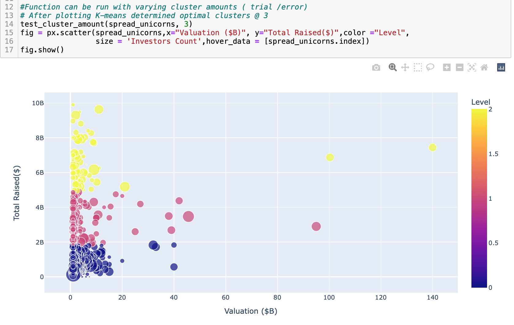
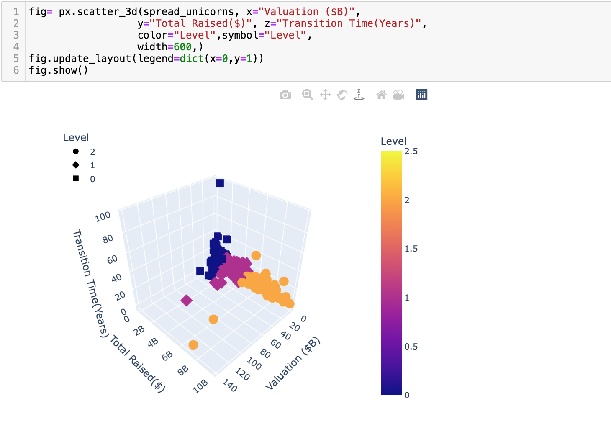

# Team_9_Final_Project

Questions to answer :

* Selected topic - Unicorn Companies Dataset

* Reason the topic was selected - Unicorn companies are companies that have a valuation of at least 1B .The relativity of the dataset in the current economic climate and the unique projected value of these companies makes this project interesting. The dataset has mainly categorical data which will be used to show the current state of the companies under review.

* Description of the source of data - Kaggle

* Questions the team hopes to answer with the data - To establish the relationship between the country of origin,industry and the time it takes for a company to raise enough capital to be considered a Unicorn company

* Description of the data exploration phase of the project- We reviewed multiple possible data sets and landed on this one after checking the steps used to preprocess the data. As the project progresses the plan is to incorporate other datasets with similar characteristics and compare the trajecory of non Unicorns.

* Description of the analysis phase of the project - Using Pandas and Jupyter Notebook the original dataset Unicorn Companies.csv was used and evaluated for relevance of the data towards the objective of the project. Eventually, columns that provided little useful information were dropped and the remaining columsns were used to extract the required data.

* Technologies, languages, tools, and algorithms used throughout the project - Througout the project Pandas, Jupyter Notebook , Postgres SQL and Tableau will be used.

* Result of analysis - 
Initially the objective of the project was to ue the dataset to determine the likelihood that a unicorn company would be acquired or have another transitionary development. It was soon discovered that a categorocal outcome of this nature would not be possible as only 2% of companies achieve any status. The analysis then shifted to use unsupervised ML where the relationships between the data could be represented. We used Kmeans for clustering and then visualized the results using scatter plots. 

* Recommendation for future analysis - 

* Anything the team would have done  - 

