# Overview of the analysis:
Unicorn" is a term used in the venture capital industry to describe a privately owned startup company with a value of over $1 billion. The term was first popularized by venture capitalist Aileen Lee, founder of Cowboy Ventures, a seed-stage venture capital fund based in Palo Alto, California.In this project the Team wishing to establish the relationship between the country of origin,industry and the transition time it takes for a company to raise enough capital to be considered a Unicorn company using the supervised and unsupervised machine learning algorithms, and using tableau to display and tell the story. The Team reviewed multiple datasets and agreed on this one after checking the steps used to preprocess the data. As the project progresses the team plan is to incorporate other datasets with similar characteristics and compare the trajectory of nonUnicorns companies.

The reason the Team chose this topic is the relativity of the dataset in the current economic climate and the unique projected value of these companies makes this project interesting. The dataset also has good mix of continuous and categorical data. 

Results:

Below shows a png of the machine learning and unsupervised

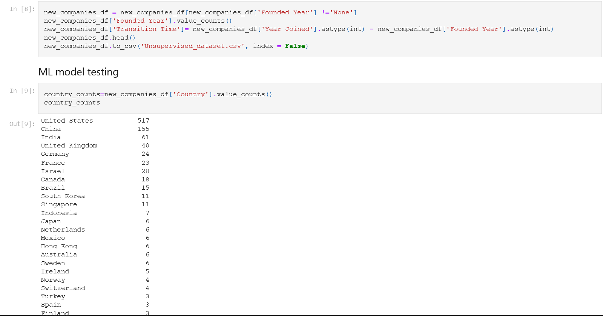

Below shows a PNG of the Preprocessing Data

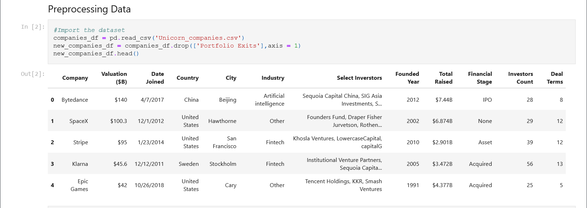

Below shows a png of the prediective value 

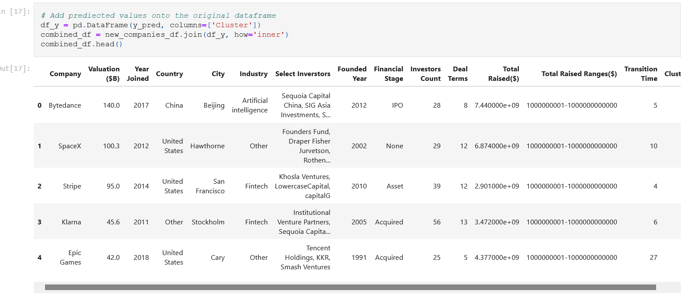

the ERD below shows the relationship between the induastries, company_ernings, status, company info and investors_info

# Describing The Data Exploration phase.

Using Kaggle.com we were able to come up with some datasets saved in the Resources folder.

Exploring the unsupervised dataset,we first read the csv file.

Data clearning is important for getting good and readable result, so we dropped some columns like "Financial Stage", "Total Raised Ranges($)", "Deal terms". Then renamed the "Transition Time" column to "Transition Time (Years)

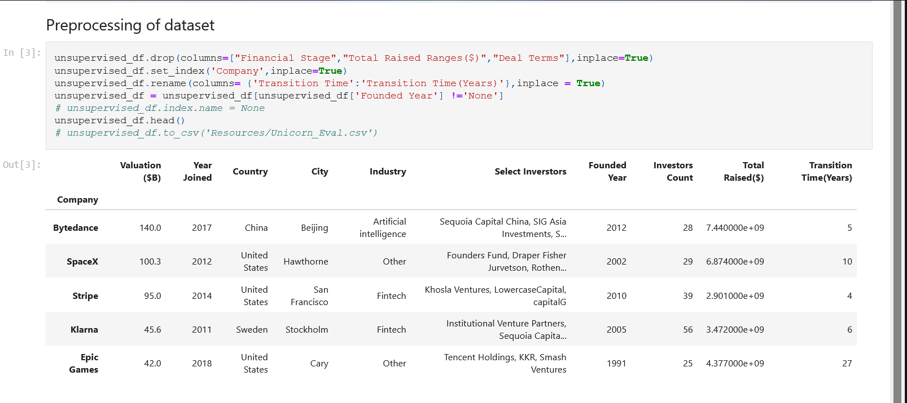

Created a DataFrame with the ten principal components

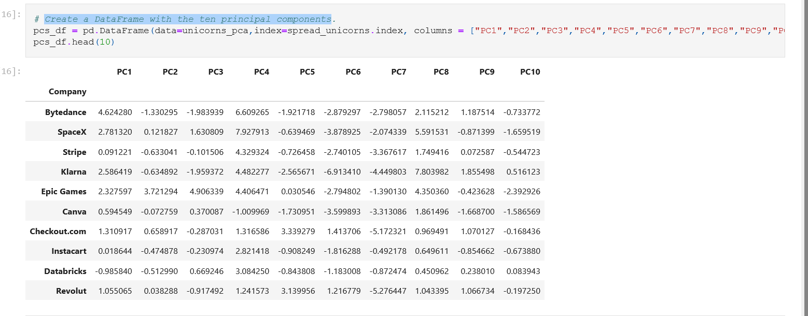

using the import india dataset we tried to establish a relationship between the country of origin,industry and the time it takes for a company to raise enough capital to be considered a Unicorn company. 

Below is a png of the loaded data

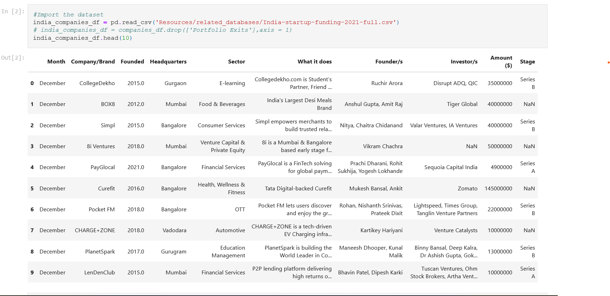

below is a png showing month count

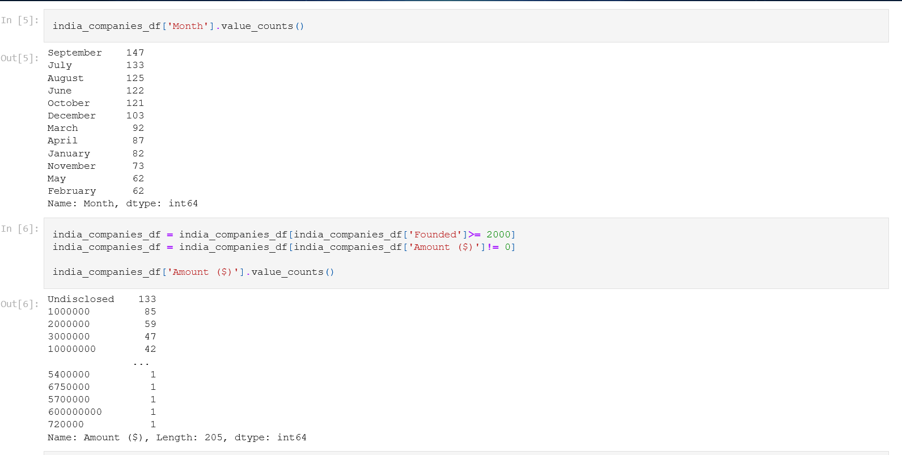

below is a png showing null values

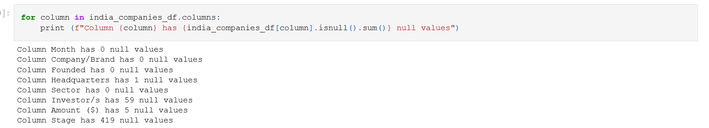

Using 3D scatter plot with plotly express 
plotting k-means determined optimal 3D cluster calling 
x axis as Valuation ($B)
y axis as Total Raised ($)
z axis as Transition Time (Year)

 
tested cluster amount and call out x and y axis x= Valuation ($B) and y= Total Raised ($)

using Elbow curve

we valuated by country using the unsupervised dataframe call the x and y axis 
x = Country
Y = Total Raised ($)

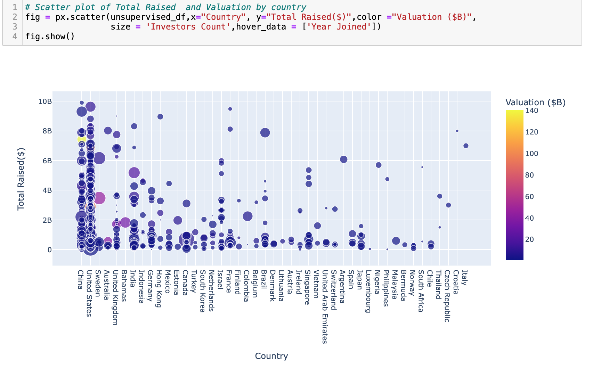

here is a Png of a scattered plot of trasition time and Valuation by country

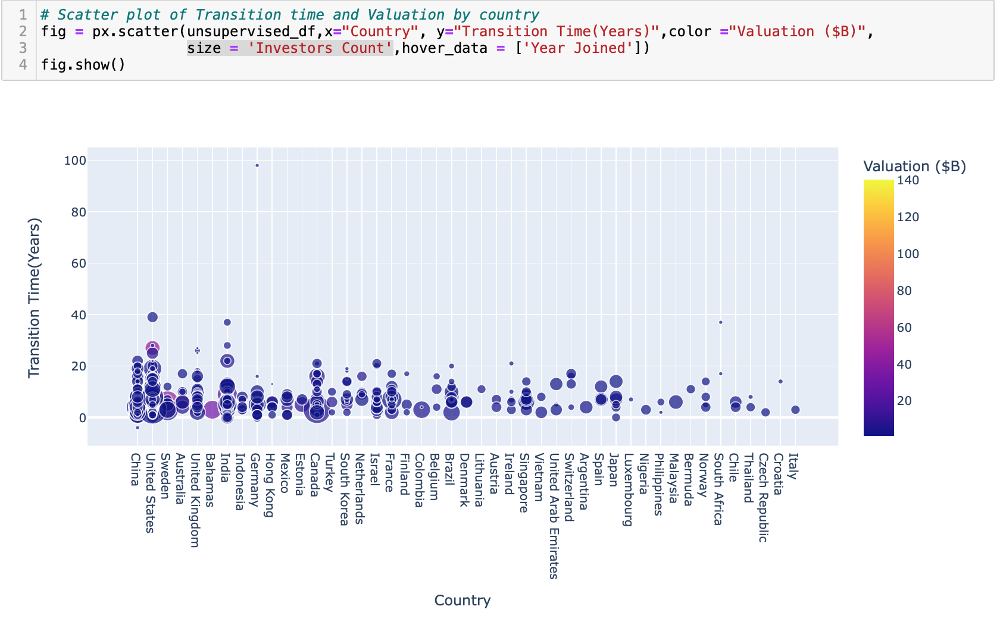

Plot of total raised and valuation by industry

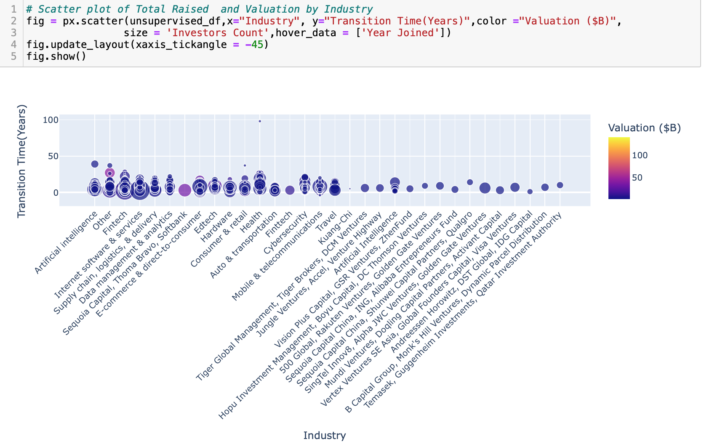
