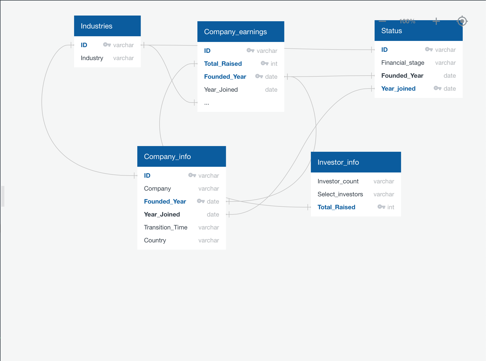
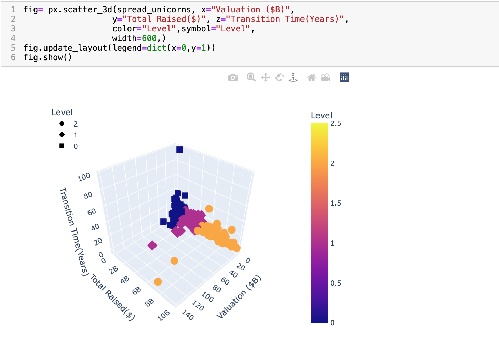
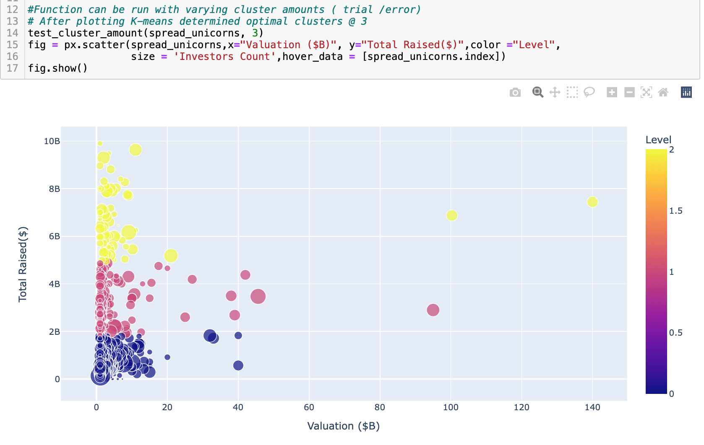
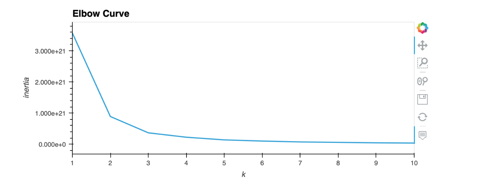

# Overview of the analysis:

"Unicorn" is a term used in the venture capital industry to describe a privately owned startup company with a value of over $1 billion. The term was first popularized by venture capitalist Aileen Lee, founder of Cowboy Ventures, a seed-stage venture capital fund based in Palo Alto, California.

## Project Team Members:

   Harold Fraser
   
   Dhru Gohil
   
   kajev Mylvaganam
   
   Zeinab Homayounmehr
   
   Joshua Osagie

## Reason Why we chose this topic:

The reason the team chose this topic is the relativity of the dataset in the current economic climate and the unique projected value of these companies make this project interesting. The dataset also has a good mix of continuous and categorical data. 

## Description of the data and data source:
The datasets were retrieved from Kaggle.

## Questions we hope to answer with the data:

To seek to establish a relationship between the country of origin, industry, and the time it may take for a company to raise enough capital to be considered a Unicorn company. Also, the likelihood that a company that has a projected value of at least 1Billion could achieve unicorn status.

## Description of the data exploration phase of the project:

We reviewed multiple possible data and opted for this after checking the steps used to preprocess the data. As the project progresses the plan was to incorporate other datasets with similar characteristics and compare the trajectory of companies at the non-Unicorns stage.

## Tools Used
The following lists the technologies used for this project:

## Tools:
    Pandas
    Numpy
    Tensorflow
    Jupyter Notebook

## Database:
    PostgreSQL
    pgAdmin

## Machine Learning:
   Scikit-learn
   TensorFlow

## Analysis:
    Matplotlib, Plotly
    Google Slides
    Tableau

## Description of data preprocessing:

 To preprocess the data for use in the machine learning models, we completed the following steps:

    1. Selected desired columns from the database
    2. Use the fill na function to replace any NaN values with 0
    3. Convert the date column to DateTime datatype

## Created Dashboard Using Tableau

Using the Tableau, we used three color schemes, Gold, silver, and bronze to display Valuations (B$) based on the cluster, the Average transition time in each cluster, the main industries in each cluster, and a map showing the percentage of clusters by country

 

## Entity Relationship Diagram (ERD)

A graphical representation that shows relationships among Industries, Company_earnings, Company_info, Investor_info, and Status

## Results:

[Database sql query](https://github.com/Jusharry/Team_9_Final_Project/blob/Dhru/databasequery.sql)

[Tableau](https://public.tableau.com/app/profile/zeinab.homayounmher/viz/UnicornCompany_16492890602400/test?publish=yes)

[Unicorns company code](https://github.com/Jusharry/Team_9_Final_Project/blob/Simple_Leaflet_Map/Unicorn_Companies_Project.ipynb)

From the Unicorn company data, an Unsupervised dataset was created and made available in the Resources folder

[Unsupervised ML code we called Unicorns Evaluation ](https://github.com/Jusharry/Team_9_Final_Project/blob/Harry/Unicorns_Evaluation.ipynb)

[India startup company code](https://github.com/Jusharry/Team_9_Final_Project/blob/Harry/India_startups.ipynb)

[python database](https://github.com/Jusharry/Team_9_Final_Project/blob/Dhru/database_python.ipynb)

## The problem encountered when trying to reach the set goal

Initially, the team wanted to use both the supervised and unsupervised machine learning algorithms. While trying to use the supervised machine learning model we encountered some problems, which include the lack of useful labeled columns.
Without these, the model we would get would have way too many rows and barely any conclusive information. There is only one useful numerical column which is the Valuation.
If we had data over time then this approach would have been feasible; we could then use the funding per year and create more variables to insert into the Supervised ML model.

The problem encountered when trying to analyze the Indian dataset, to see the likelihood and how much time it may take for the companies in the dataset to raise enough capital, and then be considered to be Unicorn companies. Our attempt to scrape Valuation data from the web for the India dataset did not yield the desired result.

## Using 3D scatter plot with Plotly express. 

calling: 
 x-axis as Valuation ($B) 
 y-axis as Total Raised ($)
 z-axis as Transition Time (Year)

Tested cluster amount and call out x and y-axis 
 x= Valuation ($B) 
 y= Total Raised ($)

Elbow curve

## Group Presentation

    Presentation on Google Slides Group 9

 
